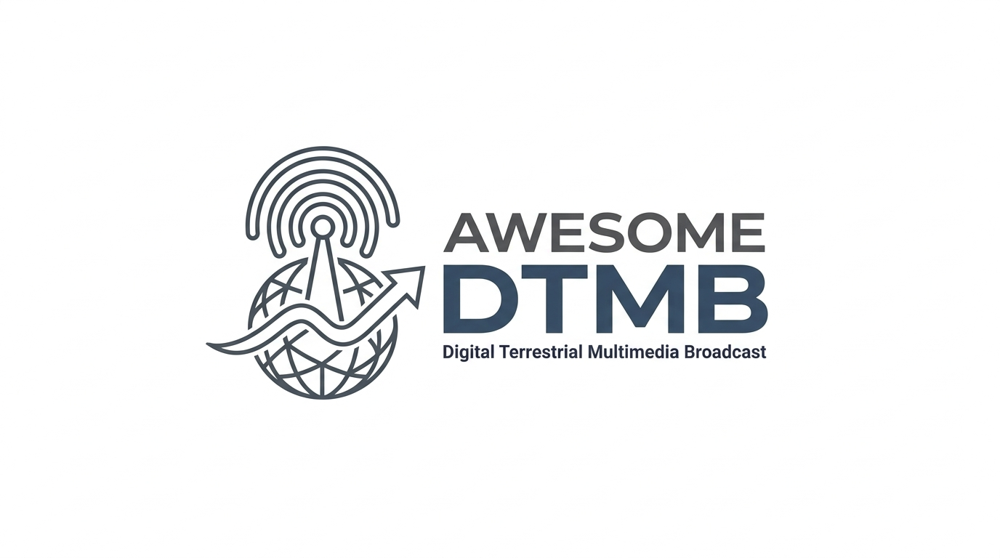

# awesome-dtmb
Everything you need to know about DTMB(Digital Terrestrial Multimedia Broadcast)


> Logo Generated by *Nano Banana 2*

## 标准与协议

- [DTMB 标准](https://openstd.samr.gov.cn/bzgk/gb/newGbInfo?hcno=41F48525779777A75F0898B87E9BD24E) - GB 20600-2006 《数字电视地面广播传输系统帧结构、信道编码和调制》
- [MPEG-TS 标准](https://www.iso.org/standard/91403.html) -  ISO/IEC 13818-1:2025
- [DTMB-A](https://www.itu.int/en/ITU-R/terrestrial/broadcast/Americas/Documents/Presentations_Panama/DTMB-A.pdf) - DTMB-A通过引入更高阶的调制方式（如256QAM、1024QAM）和更先进的纠错编码，在相同带宽下将传输速率提升了30%以上。针对超高清视频传输，DTMB-A还支持双载波聚合（Carrier Aggregation），即将两个物理频道合并为一个逻辑通道，实现超过100Mbps的净负载速率 。

### 视频标准

#### AVS

[AVS 官方网站](https://www.avs.org.cn/index.php/index/list?catid=7) - 数字音视频编解码技术标准工作组 资料下载

- AVS (CAVS / AVS1-P2 / AVS JiZhun / 基准类)
    - 现行国家标准 GB/T 20090. 2—2013
    - [《信息技术 先进音视频编码 第2部分：视频》](https://openstd.samr.gov.cn/bzgk/gb/newGbInfo?hcno=AD0D3FA994651694F95F9E1364B88193)

- AVS+ (AVS1-P16 / AVS Guangdian / 广播类)
    - 现行国家标准 GB/T 20090.16-2016
    - [《信息技术 先进音视频编码 第16部分：广播电视视频》](https://openstd.samr.gov.cn/bzgk/std/newGbInfo?hcno=1D4AC2D4256C8DE7E0AA286CA7649300)

- AVS2 - 用于传输 4K 超高清节目
    - 现行国家标准 GB/T 33475.2-2024
    - [《信息技术 高效多媒体编码 第2部分：视频》](https://openstd.samr.gov.cn/bzgk/gb/newGbInfo?hcno=C23145CA7C18AC718FDE2589AC626D6E)

- AVS3 - 用于传输 8K 超高清节目
    - 现行行业标准 GY/T 368-2023
    - [《先进高效视频编码》](https://www.nrta.gov.cn/art/2023/8/30/art_3715_65407.html)

#### HDR

- HDR Vivid
    - 现行行业标准 GY/T 358—2022
    - [《高动态范围电视系统显示适配元数据技术要求》](https://www.nrta.gov.cn/art/2022/9/29/art_3715_61973.html)

#### 其余标准
- MPEG-2 (H.262)
- AVC (H.264)
- HEVC (H.265)
- VVC (H.266)

### 音频标准

- MPEG-1

- DRA
    - 现行国家标准 GB/T 22726-2008
    - [《多声道数字音频编解码技术规范》](https://openstd.samr.gov.cn/bzgk/gb/newGbInfo?hcno=824F2100959498D71AD5345FD1018364)

- Audio Vivid - 菁彩三维声
    - [ITU-R BS.2493-1 Annex 4](https://www.itu.int/dms_pub/itu-r/opb/rep/R-REP-BS.2493-1-2024-PDF-E.pdf)

## 硬件接收设备

### USB 接收棒

- LeTV
    - Drivers
        - Linux Driver
    - Clients

- CH1 第一波道（2009）

- [融合电视伴侣](https://www.znds.com/bbs-291-1.html)（2015） - 北京融合视讯科技有限公司生产，支持 DVB-C / DTMB

- TBS5210 DTMB TV Tuner USB Box
- https://www.tbsiptv.com/download/tbs5210/TBS5210-DTMB-USB-user_guide.pdf

### PCI-E

- TBS6514 DTMB Quad Tuner PCI-E Card

### 电视

2015年后国内生产的电视大都支持。

### 数字电视机顶盒

### SDR

### 天线

### 解调器芯片

#### 凌汛科技 (Legend Silicon) - 由清华大学的技术团队创立

```
型号系列	推出时间	技术亮点	市场地位
LGS-8G13	2006年	首款融合单、多载波解调的商用芯片，支持全模式GB 20600-2006。	开创性产品，早期机顶盒标配。
LGS-8G42	2007年	引入了更先进的信道估计算法，增强了在高速移动环境（如高铁、公交）下的接收稳定性。	移动接收市场占有率第一。
LGS-8G52	2008年	功耗大幅降低，首次进入联想等一线PC厂商的数字电视棒供应链。	消费电子外设领域的主力型号。
LGS-8G75	2009年	针对大城市复杂楼宇反射环境优化的解调算法，抗回波能力提升显著。	早期电视一体机（iDTV）的首选方案。
```

#### 上海高清 (Shanghai HDIC) - 核心团队源自上海交通大学

- [HD2810A](https://news.sjtu.edu.cn/jdyw/20180405/11219.html) - 我国第一枚具有完全自主的知识产权并且符合中国数字电视地面传输标准的数字电视解调芯片
- HD2812 - 具备完备的国标单载波信号的信道解调功能并内部集成AD采集器和锁相环，可以支持模拟中频输入，有效降低了成本
- HD2910 - 具有卓越和全方位国标单、多载波的地面信道解调功能,支持地面国标的所有技术模式和选项的接收解调 ,具有强大的载波和定时回复能力,均衡器可应付强回波以及优异的同频和邻频干扰抑制功能.它同时具备高集成性等特点,内部集成AD采样器和锁相环,进一步降低板级BOM成本,便于用户使用

#### 卓胜微 (Maxscend)

- 卓胜微 MXD1320

#### 高拓讯达 ([ALTOBEAM](https://www.altobeam.com/channels/4.html))

- ATBM8881是一款支持DTMB和DVB-C数字电视标准的解调器芯片，和高拓讯达公司的DVB系列解调器芯片管脚兼容。
- ATBM8880是一款支持DTMB数字电视标准的解调器芯片，和高拓讯达公司的DVB系列解调器芯片管脚兼容。
- ATBM8869T-1是一款支持DTMB数字电视标准的解调器芯片，和高拓讯达公司的DVB系列解调器芯片管脚兼容。主要针对机顶盒市场。

### 集成化

随着半导体工艺迈向28纳米及更先进制程，电视主处理器（SoC）的算力大幅提升，原本独立的解调芯片（Standalone Demodulator）开始面临被集成（Integrated）的命运。这是半导体产业发展的必然规律，旨在降低整机BOM成本、减小PCB面积并优化功耗 。


## 驱动程序与系统支持

### Linux

- [Linux DVB API](https://www.kernel.org/doc/html/v5.0/media/uapi/dvb/dvbapi.html)
- DVB Core
- [DtmbUSB](https://github.com/nxdong520/DtmbUSB): 乐视、爱华和CVB电视棒的Linux驱动

### Windows

- [广播驱动架构（Broadcast Driver Architecture）](https://learn.microsoft.com/zh-cn/windows-hardware/drivers/stream/broadcast-driver-architecture-minidrivers)
- [bdadev](https://sourceforge.net/projects/bdadev/): A Sourceforge Project dedicated to the development of Open-Source BDA Drivers and Tools

### Android

## 软件工具

- [AltDVB](https://www.altx.ro/projects/altdvb/): 罗马尼亚开发者开发的DVB兼容电视接收软件
- [hysAnalyser](https://github.com/zymill/hysAnalyser/) - 专业 MPEG-TS 数据分析和转换工具，支持 AVS1-P2, AVS1-P16, AVS2, AVS3 视频的解码。

### 播放器
- [VLC 2.2.6 with AVS/AVS+ and DRA support](https://gitcode.com/open-source-toolkit/b2eba): 社区改进的 VLC 播放器，支持 AVS1-P16 视频解码和 DRA 音频解码
- [VlcAvsDra](https://github.com/zuifengjianke/VlcAvsDra): 安卓版本的 VLC 播放器，支持 AVS1-P16 视频解码和 DRA 音频解码
- [VLC 3.0.11.1 with AVS3-AVS2-CAVS](https://gitee.com/zhengtianbo/VLC3-AVS3AVS2CAVS): zhengtianbo开发的VLC播放器，支持AVS1-P2, AVS2, AVS3，提供基于VLC和ffmpeg的两种修改方案。
- [MPC-HC with AVS3-AVS2-CAVS](https://gitee.com/zhengtianbo/cavs-avs2-avs3_decoder_added_to_mpc_hc): zhengtianbo修改的MPC-HC，添加AVS, AVS2, AVS3 支持

### 解码滤镜
- [LAVFilters CAVS AVS2 AVS3](https://gitee.com/zhengtianbo/LAVFilters-GB-CAVS-AVS2-AVS3-decoder)

### 转码与流媒体处理

- [zhengtianbo/FFmpeg-avs2-avs3](https://gitee.com/zhengtianbo/FFmpeg-avs2-avs3): 添加了AVS2与AVS3支持的FFmpeg


## 频道与频率数据

- [中国地面波数字电视接收参数](http://dtmb.saoing.com/) - 由爱好者维护的各省市自治区直辖市（包括港澳台）的地面波数字电视接收频率

## 开发资源

- [OpenAVS](https://sourceforge.net/projects/openavs/) - AVS1-P2解码器的开源实现
- [xavs](https://xavs.sourceforge.net/) - AVS1-P2/AVS1-P8编解码器的开源实现
- [xavs2](https://github.com/pkuvcl/xavs2) - 北京大学 AVS2 编码器的开源实现
- [davs2](https://github.com/pkuvcl/davs2) - 北京大学 AVS2 解码器的开源实现
- [uavs3e](https://github.com/uavs3/uavs3e) - AVS3 encoder which supports AVS3-P2 baseline profile.
- [uavs3d](https://github.com/uavs3/uavs3d) - AVS3 decoder which supports AVS3-P2 baseline profile.
- [DRA-Audio-System](https://github.com/tianyigeng/DRA-Audio-System) - DRA 编解码器的开源实现

> 截至目前（2026年2月），没有以开源协议发布的 AVS1-P16 实现。
>
> - https://lists.ffmpeg.org/archives/list/ffmpeg-devel@ffmpeg.org/thread/PR76B6WXNRSDUFC7NWXXBC5SNXLUHNHT/#LTGO6KIURYEDLMVIVBCD6QPWPMFOUN4E
> - https://github.com/intel/libva/pull/738/changes
> - Moore Threads, have finished Chinese AVS&AVS2 hwaccel decoding under FFMpeg-VAAPI framework. All their public products, MTT S10/MTT S50/MTT S80/MTT S2000/... support AVS&AVS+ decoding at max 2K and support AVS2 Main&Main10 decoding at max 8K.

- [avs2_avs3_test_video](https://gitee.com/zhengtianbo/avs2_avs3_test_video): 提供AVS2和AVS3编码的测试文件

- [让TSCutter.GUI支持解码AVS+(AVS1-P16)编码的TS文件](https://github.com/nilaoda/Blog/discussions/87)

- [AVS与AVS+的对比](https://blog.csdn.net/weixin_43360707/article/details/131128946)

## 社区论坛

- [中文寻星论坛](https://bbs.asiadvb.net/forum.php)
